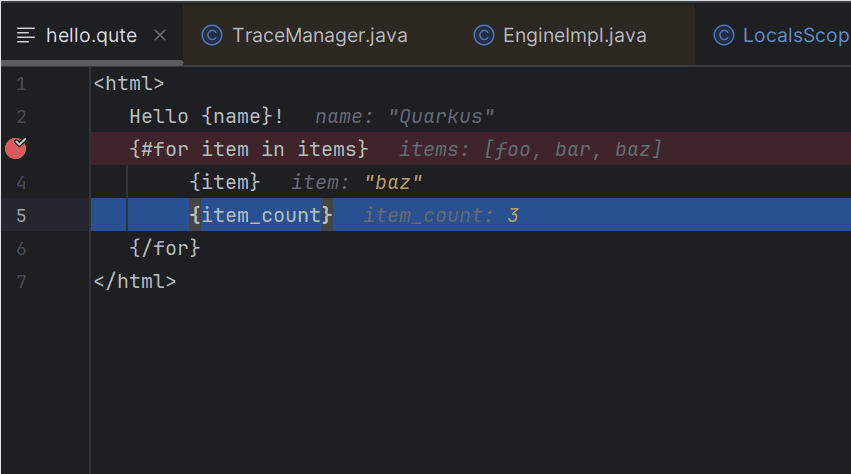
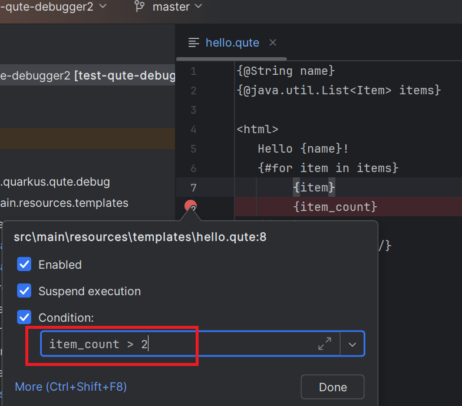

# Qute Debugger

Qute Debugger allows you to `debug Qute templates using breakpoints` in any IDE/editor that supports the [Debug Adapter Protocol](https://microsoft.github.io/debug-adapter-protocol/), including [VS Code](https://code.visualstudio.com/), [IntelliJ (via LSP4IJ)](https://github.com/redhat-developer/lsp4ij), and [Eclipse IDE (via LSP4E)](https://github.com/eclipse-lsp4e/lsp4e).  
It works seamlessly with a simple `Java main` class or within a `Quarkus application`:



## How does it work?

The Qute debugger server (DAP) starts a `ServerSocket` on a given `port` from the Java main or Quarkus application.  
Then, a DAP client (such as [VS Code](https://code.visualstudio.com/), [IntelliJ (via LSP4IJ)](https://github.com/redhat-developer/lsp4ij), or [Eclipse IDE (via LSP4E)](https://github.com/eclipse-lsp4e/lsp4e)) connects to that socket using [attach mode](https://microsoft.github.io/debug-adapter-protocol/specification#Requests_Attach) by specifying the correct `port`.

Here are the steps to enable Qute template debugging:

- On the server side, the debugger must be registered via `io.quarkus.qute.debug.adapter.RegisterDebugServerAdapter`, which implements `io.quarkus.qute.EngineBuilder$EngineListener` to track the `Engine` instance.
- When the application starts, the `ServerSocket` is created if a debug port is defined (e.g., using the `-Dqute.debug.port` environment variable).
- On the client side, the DAP client connects to the DAP server using the configured port.

## In a Java Main Class

### Register the Debug Server Adapter (DAP)

Register the debugger as follows:

```java
Engine engine = Engine.builder()
        .enableTracing(true) // enable tracing required by debugger
        .addEngineListener(new RegisterDebugServerAdapter()) // enables template debugging
        .build();
```

### Start application in debug mode

Configure the Java process to enable debugging by setting the debug port:

```
-Dqute.debug.port=12345`
```

The DAP client must then connect using a client socket to port `12345`.

### In Quarkus application

### Register the debug server adapter (DAP)

This works out of the box. In Quarkus dev mode, register the debugger with the following observer:

```java
import io.quarkus.qute.EngineBuilder;
import io.quarkus.qute.debug.adapter.RegisterDebugServerAdapter;
import jakarta.enterprise.context.ApplicationScoped;
import jakarta.enterprise.event.Observes;

@ApplicationScoped
public class DebugQuteEngineObserver {

    private RegisterDebugServerAdapter registar = new RegisterDebugServerAdapter();

    void configureEngine(@Observes EngineBuilder builder) {
        builder.enableTracing(true);
        builder.addEngineListener(registar);
    }
}
```

### Start application in debug mode

Configure the Quarkus application with the debug port:

```
-DquteDebugPort=12345`
```

Again, the DAP client must connect using a client socket to port `12345`.

TODO: Add support for configuring `quteDebugPort` via `application.properties`.

## Features

### Breakpoints

#### Simple Breakpoint


#### Conditional Breakpoint



### Expression evaluation

### Completion

### Show Variables